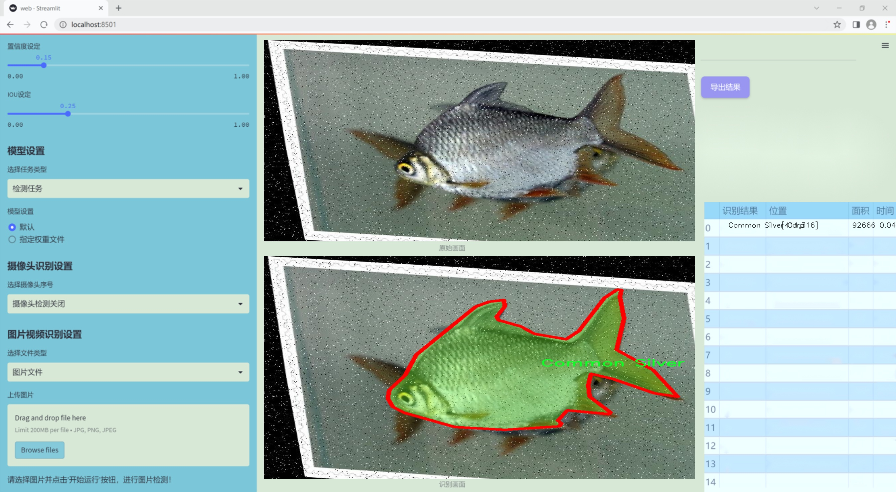
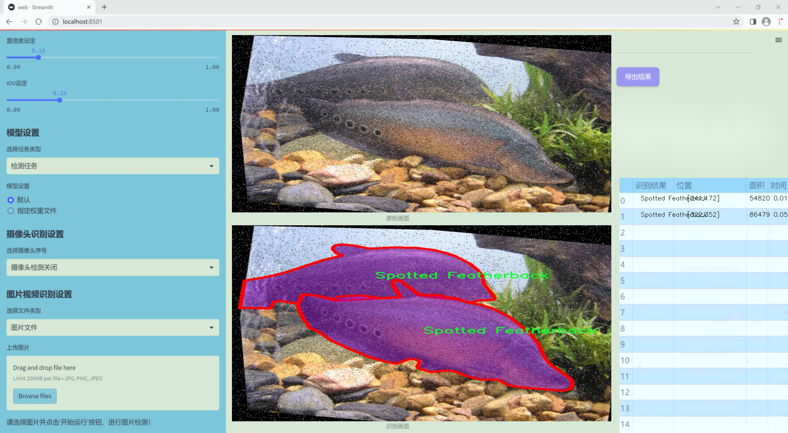
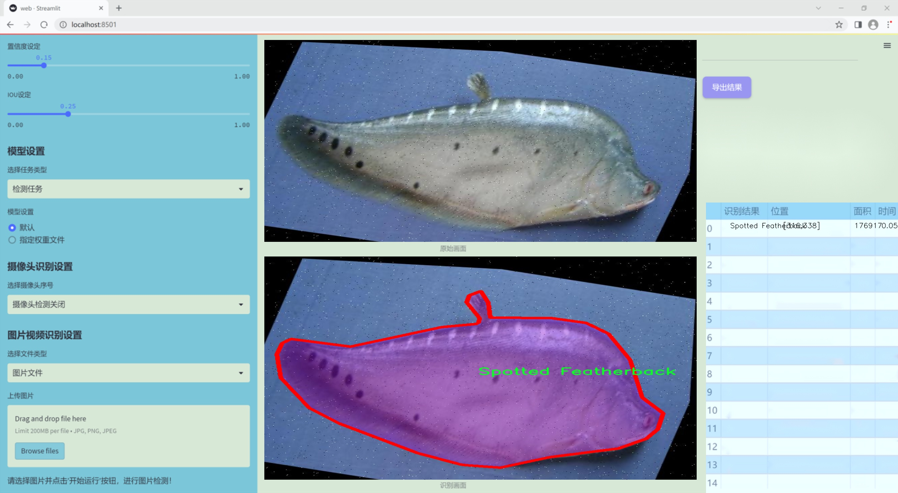
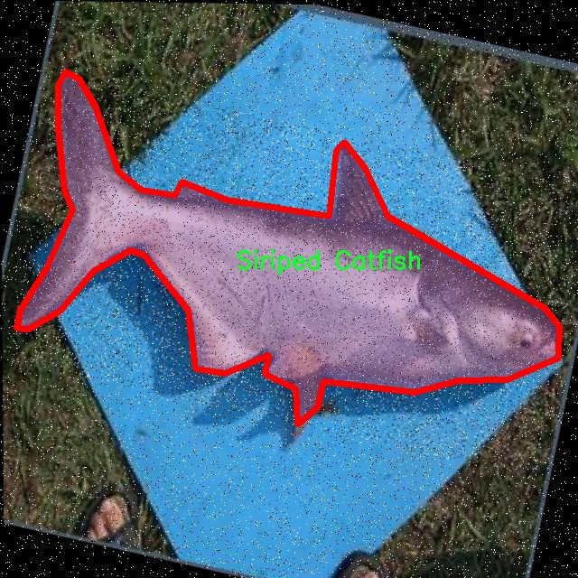
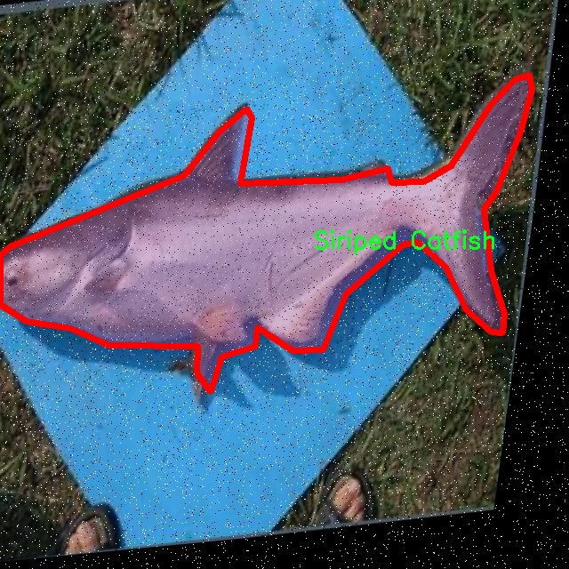
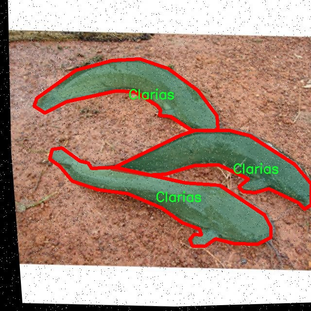
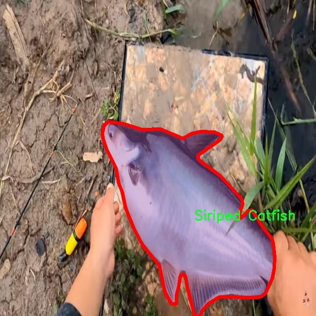
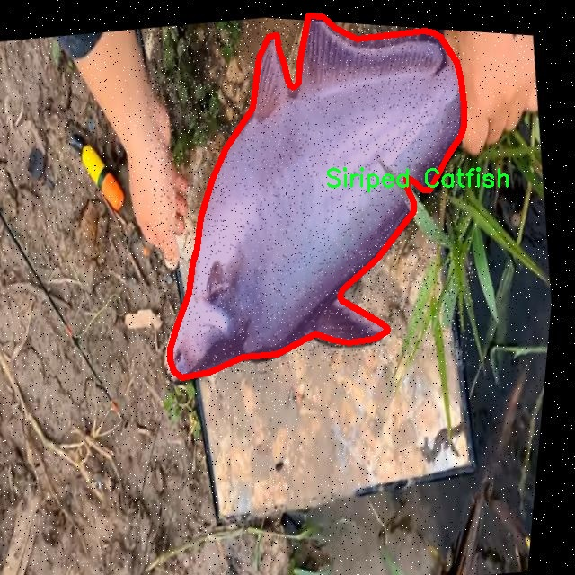

### 1.背景意义

研究背景与意义

随着全球淡水资源的日益紧张，淡水鱼类的保护与管理变得愈发重要。淡水鱼类不仅是生态系统的重要组成部分，也是人类食品链中不可或缺的资源。对淡水鱼种类的准确识别和分类，能够为生态保护、渔业管理以及水域生物多样性研究提供重要的科学依据。然而，传统的鱼类识别方法往往依赖于人工观察和专家知识，效率低下且容易受到主观因素的影响。因此，基于计算机视觉技术的自动化鱼类识别系统应运而生。

近年来，深度学习技术的迅猛发展为图像识别领域带来了革命性的变化，尤其是YOLO（You Only Look Once）系列算法在目标检测和图像分割任务中表现出色。YOLOv11作为该系列的最新版本，具备更高的准确性和实时性，适合于处理复杂的图像数据。在此背景下，基于改进YOLOv11的淡水鱼种类识别图像分割系统的研究显得尤为重要。

本项目所使用的数据集包含七种不同的淡水鱼类，包括Anabas、Clarias、Common Silver Carp、Nile Tilapia、Red Tilapia Fish、Siriped Catfish和Spotted Featherback，共计291张经过精确标注的图像。这些图像经过多种预处理和增强技术的处理，能够有效提高模型的鲁棒性和泛化能力。通过对这些鱼类进行高效的图像分割与识别，不仅可以提高淡水鱼类的监测效率，还能为渔业资源的可持续利用提供科学依据。

综上所述，基于改进YOLOv11的淡水鱼种类识别图像分割系统的研究，不仅具有重要的学术价值，也为实际应用提供了可行的解决方案。通过这一系统的开发与应用，能够推动淡水鱼类保护和管理的智能化进程，为生态环境的可持续发展贡献力量。

### 2.视频效果

[2.1 视频效果](https://www.bilibili.com/video/BV1UDBaYkENK/)

### 3.图片效果







##### [项目涉及的源码数据来源链接](https://kdocs.cn/l/cszuIiCKVNis)**

注意：本项目提供训练的数据集和训练教程,由于版本持续更新,暂不提供权重文件（best.pt）,请按照6.训练教程进行训练后实现上图演示的效果。

### 4.数据集信息

##### 4.1 本项目数据集类别数＆类别名

nc: 7
names: ['Anabas', 'Clarias', 'Common Silver Carp', 'Nile Tilapia', 'Red Tilapia Fish', 'Siriped Catfish', 'Spotted Featherback']


该项目为【图像分割】数据集，请在【训练教程和Web端加载模型教程（第三步）】这一步的时候按照【图像分割】部分的教程来训练

##### 4.2 本项目数据集信息介绍

本项目数据集信息介绍

本项目旨在通过改进YOLOv11模型，构建一个高效的淡水鱼种类识别图像分割系统，以支持水产养殖、生态研究及生物多样性保护等领域的应用。为实现这一目标，我们构建了一个专门针对淡水鱼种类的图像数据集，涵盖了七个主要类别的鱼类。这些类别包括：Anabas、Clarias、Common Silver Carp、Nile Tilapia、Red Tilapia Fish、Siriped Catfish和Spotted Featherback。每个类别的选择都基于其在淡水生态系统中的重要性以及在水产养殖业中的经济价值，确保数据集的代表性和实用性。

数据集的构建过程经过精心设计，包含了多样化的图像样本，涵盖不同的拍摄角度、光照条件和背景环境，以提高模型的泛化能力。每个类别的图像均经过标注，确保在训练过程中能够准确识别和分割不同种类的淡水鱼。这种精细化的标注不仅有助于提高模型的识别精度，还为后续的研究提供了丰富的数据基础。

此外，为了提升模型的鲁棒性，数据集中还包括了部分鱼类在自然栖息环境中的图像，旨在模拟真实世界中的应用场景。这种多样化的训练数据将使得改进后的YOLOv11模型在实际应用中表现出更强的适应性和准确性，能够有效应对不同环境下的淡水鱼种类识别任务。

通过这一数据集的应用，我们期望能够推动淡水鱼种类识别技术的发展，为相关领域的研究和实践提供有力支持。











### 5.全套项目环境部署视频教程（零基础手把手教学）

[5.1 所需软件PyCharm和Anaconda安装教程（第一步）](https://www.bilibili.com/video/BV1BoC1YCEKi/?spm_id_from=333.999.0.0&vd_source=bc9aec86d164b67a7004b996143742dc)


[5.2 安装Python虚拟环境创建和依赖库安装视频教程（第二步）](https://www.bilibili.com/video/BV1ZoC1YCEBw?spm_id_from=333.788.videopod.sections&vd_source=bc9aec86d164b67a7004b996143742dc)

### 6.改进YOLOv11训练教程和Web_UI前端加载模型教程（零基础手把手教学）

[6.1 改进YOLOv11训练教程和Web_UI前端加载模型教程（第三步）](https://www.bilibili.com/video/BV1BoC1YCEhR?spm_id_from=333.788.videopod.sections&vd_source=bc9aec86d164b67a7004b996143742dc)


按照上面的训练视频教程链接加载项目提供的数据集，运行train.py即可开始训练



     Epoch   gpu_mem       box       obj       cls    labels  img_size
     1/200     20.8G   0.01576   0.01955  0.007536        22      1280: 100%|██████████| 849/849 [14:42<00:00,  1.04s/it]
               Class     Images     Labels          P          R     mAP@.5 mAP@.5:.95: 100%|██████████| 213/213 [01:14<00:00,  2.87it/s]
                 all       3395      17314      0.994      0.957      0.0957      0.0843

     Epoch   gpu_mem       box       obj       cls    labels  img_size
     2/200     20.8G   0.01578   0.01923  0.007006        22      1280: 100%|██████████| 849/849 [14:44<00:00,  1.04s/it]
               Class     Images     Labels          P          R     mAP@.5 mAP@.5:.95: 100%|██████████| 213/213 [01:12<00:00,  2.95it/s]
                 all       3395      17314      0.996      0.956      0.0957      0.0845

     Epoch   gpu_mem       box       obj       cls    labels  img_size
     3/200     20.8G   0.01561    0.0191  0.006895        27      1280: 100%|██████████| 849/849 [10:56<00:00,  1.29it/s]
               Class     Images     Labels          P          R     mAP@.5 mAP@.5:.95: 100%|███████   | 187/213 [00:52<00:00,  4.04it/s]
                 all       3395      17314      0.996      0.957      0.0957      0.0845


###### [项目数据集下载链接](https://kdocs.cn/l/cszuIiCKVNis)

### 7.原始YOLOv11算法讲解


ultralytics发布了最新的作品YOLOv11，这一次YOLOv11的变化相对于ultralytics公司的上一代作品YOLOv8变化不是很大的（YOLOv9、YOLOv10均不是ultralytics公司作品），其中改变的位置涉及到C2f变为C3K2，在SPPF后面加了一层类似于注意力机制的C2PSA，还有一个变化大家从yaml文件是看不出来的就是它的检测头内部替换了两个DWConv，以及模型的深度和宽度参数进行了大幅度调整，但是在损失函数方面就没有变化还是采用的CIoU作为边界框回归损失，下面带大家深入理解一下ultralytics最新作品YOLOv11的创新点。

**下图为最近的YOLO系列发布时间线！**


* * *

###### YOLOv11和YOLOv8对比

在YOLOYOLOv5，YOLOv8，和YOLOv11是ultralytics公司作品（ultralytics出品必属精品），下面用一张图片从yaml文件来带大家对比一下YOLOv8和YOLOv11的区别，配置文件变得内容比较少大家可以看一卡，左侧为YOLOv8右侧为YOLOv11，不同的点我用黑线标注了出来。


* * *

###### YOLOv11的网络结构解析

下面的图片为YOLOv11的网络结构图。


**其中主要创新点可以总结如下- > **

* * *

1\.
提出C3k2机制，其中C3k2有参数为c3k，其中在网络的浅层c3k设置为False（下图中可以看到c3k2第二个参数被设置为False，就是对应的c3k参数）。


此时所谓的C3k2就相当于YOLOv8中的C2f，其网络结构为一致的，其中的C3k机制的网络结构图如下图所示
**（为什么叫C3k2，我个人理解是因为C3k的调用时C3k其中的参数N固定设置为2的原因，个人理解不一定对** ）。


* * *

2\.
第二个创新点是提出C2PSA机制，这是一个C2（C2f的前身）机制内部嵌入了一个多头注意力机制，在这个过程中我还发现作者尝试了C2fPSA机制但是估计效果不如C2PSA，有的时候机制有没有效果理论上真的很难解释通，下图为C2PSA机制的原理图，仔细观察把Attention哪里去掉则C2PSA机制就变为了C2所以我上面说C2PSA就是C2里面嵌入了一个PSA机制。


* * *

3\.
第三个创新点可以说是原先的解耦头中的分类检测头增加了两个DWConv，具体的对比大家可以看下面两个图下面的是YOLOv11的解耦头，上面的是YOLOv8的解耦头.


我们上面看到了在分类检测头中YOLOv11插入了两个DWConv这样的做法可以大幅度减少参数量和计算量（原先两个普通的Conv大家要注意到卷积和是由3变为了1的，这是形成了两个深度可分离Conv），大家可能不太理解为什么加入了两个DWConv还能够减少计算量，以及什么是深度可分离Conv，下面我来解释一下。

> **`DWConv` 代表 Depthwise
> Convolution（深度卷积）**，是一种在卷积神经网络中常用的高效卷积操作。它主要用于减少计算复杂度和参数量，尤其在移动端或轻量化网络（如
> MobileNet）中十分常见。
>
> **1\. 标准卷积的计算过程**
>
> 在标准卷积操作中，对于一个输入张量（通常是一个多通道的特征图），卷积核的尺寸是 `(h, w, C_in)`，其中 `h` 和 `w`
> 是卷积核的空间尺寸，`C_in`
> 是输入通道的数量。而卷积核与输入张量做的是完整的卷积运算，每个输出通道都与所有输入通道相连并参与卷积操作，导致计算量比较大。
>
> 标准卷积的计算过程是这样的：
>
>   * 每个输出通道是所有输入通道的组合（加权求和），卷积核在每个位置都会计算与所有输入通道的点积。
>   * 假设有 `C_in` 个输入通道和 `C_out` 个输出通道，那么卷积核的总参数量是 `C_in * C_out * h * w`。
>

>
> 2\. **Depthwise Convolution（DWConv）**
>
> 与标准卷积不同， **深度卷积** 将输入的每个通道单独处理，即 **每个通道都有自己的卷积核进行卷积**
> ，不与其他通道进行交互。它可以被看作是标准卷积的一部分，专注于空间维度上的卷积运算。
>
> **深度卷积的计算过程：**
>
>   * 假设输入张量有 `C_in` 个通道，每个通道会使用一个 `h × w`
> 的卷积核进行卷积操作。这个过程称为“深度卷积”，因为每个通道独立进行卷积运算。
>   * 输出的通道数与输入通道数一致，每个输出通道只和对应的输入通道进行卷积，没有跨通道的组合。
>   * 参数量和计算量相比标准卷积大大减少，卷积核的参数量是 `C_in * h * w`。
>

>
> **深度卷积的优点：**
>
>   1. **计算效率高** ：相对于标准卷积，深度卷积显著减少了计算量。它只处理空间维度上的卷积，不再处理通道间的卷积。
>   2.  **参数量减少** ：由于每个卷积核只对单个通道进行卷积，参数量大幅减少。例如，标准卷积的参数量为 `C_in * C_out * h *
> w`，而深度卷积的参数量为 `C_in * h * w`。
>   3.  **结合点卷积可提升效果** ：为了弥补深度卷积缺乏跨通道信息整合的问题，通常深度卷积后会配合 `1x1` 的点卷积（Pointwise
> Convolution）使用，通过 `1x1` 的卷积核整合跨通道的信息。这种组合被称为 **深度可分离卷积** （Depthwise
> Separable Convolution） | **这也是我们本文YOLOv11中的做法** 。
>

>
> 3\. **深度卷积与标准卷积的区别**
>
> 操作类型| 卷积核大小| 输入通道数| 输出通道数| 参数量  
> ---|---|---|---|---  
> 标准卷积| `h × w`| `C_in`| `C_out`| `C_in * C_out * h * w`  
> 深度卷积（DWConv）| `h × w`| `C_in`| `C_in`| `C_in * h * w`  
>  
> 可以看出，深度卷积在相同的卷积核大小下，参数量减少了约 `C_out` 倍
> （细心的人可以发现用最新版本的ultralytics仓库运行YOLOv8参数量相比于之前的YOLOv8以及大幅度减少了这就是因为检测头改了的原因但是名字还是Detect，所以如果你想继续用YOLOv8发表论文做实验那么不要更新最近的ultralytics仓库）。
>
> **4\. 深度可分离卷积 (Depthwise Separable Convolution)**
>
> 深度卷积常与 `1x1` 的点卷积配合使用，这称为深度可分离卷积。其过程如下：
>
>   1. 先对输入张量进行深度卷积，对每个通道独立进行空间卷积。
>   2. 然后通过 `1x1` 点卷积，对通道维度进行混合，整合不同通道的信息。
>

>
> 这样既可以保证计算量的减少，又可以保持跨通道的信息流动。
>
> 5\. **总结**
>
> `DWConv` 是一种高效的卷积方式，通过单独处理每个通道来减少计算量，结合 `1x1`
> 的点卷积，形成深度可分离卷积，可以在保持网络性能的同时极大地减少模型的计算复杂度和参数量。

**看到这里大家应该明白了为什么加入了两个DWConv还能减少参数量以及YOLOv11的检测头创新点在哪里。**

* * *

##### YOLOv11和YOLOv8还有一个不同的点就是其各个版本的模型（N - S - M- L - X）网络深度和宽度变了


可以看到在深度（depth）和宽度
（width）两个地方YOLOv8和YOLOv11是基本上完全不同了，这里我理解这么做的含义就是模型网络变小了，所以需要加深一些模型的放缩倍数来弥补模型之前丧失的能力从而来达到一个平衡。

> **本章总结：**
> YOLOv11的改进点其实并不多更多的都是一些小的结构上的创新，相对于之前的YOLOv5到YOLOv8的创新，其实YOLOv11的创新点不算多，但是其是ultralytics公司的出品，同时ultralytics仓库的使用量是非常多的（不像YOLOv9和YOLOv10）所以在未来的很长一段时间内其实YOLO系列估计不会再更新了，YOLOv11作为最新的SOTA肯定是十分适合大家来发表论文和创新的。
>

### 8.200+种全套改进YOLOV11创新点原理讲解

#### 8.1 200+种全套改进YOLOV11创新点原理讲解大全

由于篇幅限制，每个创新点的具体原理讲解就不全部展开，具体见下列网址中的改进模块对应项目的技术原理博客网址【Blog】（创新点均为模块化搭建，原理适配YOLOv5~YOLOv11等各种版本）

[改进模块技术原理博客【Blog】网址链接](https://gitee.com/qunmasj/good)


#### 8.2 精选部分改进YOLOV11创新点原理讲解

###### 这里节选部分改进创新点展开原理讲解(完整的改进原理见上图和[改进模块技术原理博客链接](https://gitee.com/qunmasj/good)【如果此小节的图加载失败可以通过CSDN或者Github搜索该博客的标题访问原始博客，原始博客图片显示正常】
### 深度学习基础
卷积神经网络通过使用具有共享参数的卷积运算显著降低了模型的计算开销和复杂性。在LeNet、AlexNet和VGG等经典网络的驱动下，卷积神经网络现在已经建立了一个完整的系统，并在深度学习领域形成了先进的卷积神经网络模型。

感受野注意力卷积RFCBAMConv的作者在仔细研究了卷积运算之后获得了灵感。对于分类、目标检测和语义分割任务，一方面，图像中不同位置的对象的形状、大小、颜色和分布是可变的。在卷积操作期间，卷积核在每个感受野中使用相同的参数来提取信息，而不考虑来自不同位置的差分信息。这限制了网络的性能，这已经在最近的许多工作中得到了证实。

另一方面，卷积运算没有考虑每个特征的重要性，这进一步影响了提取特征的有效性，并最终限制了模型的性能。此外，注意力机制允许模型专注于重要特征，这可以增强特征提取的优势和卷积神经网络捕获详细特征信息的能力。因此，注意力机制在深度学习中得到了广泛的应用，并成功地应用于各个领域。

通过研究卷积运算的内在缺陷和注意力机制的特点，作者认为现有的空间注意力机制从本质上解决了卷积运算的参数共享问题，但仍局限于对空间特征的认知。对于较大的卷积核，现有的空间注意力机制并没有完全解决共享参数的问题。此外，他们无法强调感受野中每个特征的重要性，例如现有的卷积块注意力模块（CBAM）和 Coordinate注意力（CA）。

因此，[参考该博客提出了一种新的感受野注意力机制（RFA）](https://qunmasj.com)，它完全解决了卷积核共享参数的问题，并充分考虑了感受野中每个特征的重要性。通过RFA设计的卷积运算（RFAConv）是一种新的卷积运算，可以取代现有神经网络中的标准卷积运算。RFAConv通过添加一些参数和计算开销来提高网络性能。

大量关于Imagnet-1k、MS COCO和VOC的实验已经证明了RFAConv的有效性。作为一种由注意力构建的新型卷积运算，它超过了由CAM、CBAM和CA构建的卷积运算（CAMConv、CBAMConv、CAConv）以及标准卷积运算。

此外，为了解决现有方法提取感受野特征速度慢的问题，提出了一种轻量级操作。在构建RFAConv的过程中，再次设计了CA和CBAM的升级版本，并进行了相关实验。作者认为当前的空间注意力机制应该将注意力放在感受野空间特征上，以促进当前空间注意力机制的发展，并再次增强卷积神经网络架构的优势。


### 卷积神经网络架构
出色的神经网络架构可以提高不同任务的性能。卷积运算作为卷积神经网络的一种基本运算，推动了人工智能的发展，并为车辆检测、无人机图像、医学等先进的网络模型做出了贡献。He等人认为随着网络深度的增加，该模型将变得难以训练并产生退化现象，因此他们提出了残差连接来创新卷积神经网络架构的设计。Huang等人通过重用特征来解决网络梯度消失问题，增强了特征信息，他们再次创新了卷积神经网络架构。

通过对卷积运算的详细研究，Dai等人认为，具有固定采样位置的卷积运算在一定程度上限制了网络的性能，因此提出了Deformable Conv，通过学习偏移来改变卷积核的采样位置。在Deformable Conv的基础上，再次提出了Deformable Conv V2和Deformable Conv V3，以提高卷积网络的性能。

Zhang等人注意到，组卷积可以减少模型的参数数量和计算开销。然而，少于组内信息的交互将影响最终的网络性能。1×1的卷积可以与信息相互作用。然而，这将带来更多的参数和计算开销，因此他们提出了无参数的“通道Shuffle”操作来与组之间的信息交互。

Ma等人通过实验得出结论，对于参数较少的模型，推理速度不一定更快，对于计算量较小的模型，推理也不一定更快。经过仔细研究提出了Shufflenet V2。

YOLO将输入图像划分为网格，以预测对象的位置和类别。经过不断的研究，已经提出了8个版本的基于YOLO的目标检测器，如YOLOv11、YOLOv11、YOLOv11等。上述卷积神经网络架构已经取得了巨大的成功。然而，它们并没有解决提取特征过程中的参数共享问题。本文的工作从注意力机制开始，从一个新的角度解决卷积参数共享问题。

### 注意力机制
注意力机制被用作一种提高网络模型性能的技术，使其能够专注于关键特性。注意力机制理论已经在深度学习中建立了一个完整而成熟的体系。Hu等人提出了一种Squeeze-and-Excitation（SE）块，通过压缩特征来聚合全局通道信息，从而获得与每个通道对应的权重。Wang等人认为，当SE与信息交互时，单个通道和权重之间的对应关系是间接的，因此设计了高效通道注Efficient Channel Attention力（ECA），并用自适应kernel大小的一维卷积取代了SE中的全连接（FC）层。Woo等人提出了卷积块注意力模块（CBAM），它结合了通道注意力和空间注意力。作为一个即插即用模块，它可以嵌入卷积神经网络中，以提高网络性能。

尽管SE和CBAM已经提高了网络的性能。Hou等人仍然发现压缩特征在SE和CBAM中丢失了太多信息。因此，他们提出了轻量级Coordinate注意力（CA）来解决SE和CBAM中的问题。Fu等人计了一个空间注意力模块和通道注意力模块，用于扩展全卷积网络（FCN），分别对空间维度和通道维度的语义相关性进行建模。Zhang等人在通道上生成不同尺度的特征图，以建立更有效的通道注意力机制。

本文从一个新的角度解决了标准卷积运算的参数共享问题。这就是将注意力机制结合起来构造卷积运算。尽管目前的注意力机制已经获得了良好的性能，但它们仍然没有关注感受野的空间特征。因此，设计了具有非共享参数的RFA卷积运算，以提高网络的性能。


#### 回顾标准卷积
以标准卷积运算为基础构建卷积神经网络，通过共享参数的滑动窗口提取特征信息，解决了全连接层构建的神经网络的固有问题（即参数数量大、计算开销高）。

设表示输入特征图，其中、和分别表示特征图的通道数、高度和宽度。为了能够清楚地展示卷积核提取特征信息的过程，以为例。提取每个感受野slider的特征信息的卷积运算可以表示如下：


这里，表示在每次卷积slider操作之后获得的值，表示在每个slider内的相应位置处的像素值。表示卷积核，表示卷积核中的参数数量，表示感受野slider的总数。

可以看出，每个slider内相同位置的特征共享相同的参数。因此，标准的卷积运算无法感知不同位置带来的差异信息，这在一定程度上限制了卷积神经网络的性能。

#### 回顾空间注意力
目前，空间注意力机制使用通过学习获得的注意力图来突出每个特征的重要性。与上一节类似，以为例。突出关键特征的空间注意力机制可以简单地表达如下：


这里，表示在加权运算之后获得的值。和分别表示输入特征图和学习注意力图在不同位置的值，是输入特征图的高度和宽度的乘积，表示像素值的总数。一般来说，整个过程可以简单地表示在图1中。


#### 空间注意力与标准卷积
众所周知，将注意力机制引入卷积神经网络可以提高网络的性能。通过标准的卷积运算和对现有空间注意力机制的仔细分析。作者认为空间注意力机制本质上解决了卷积神经网络的固有缺点，即共享参数的问题。

目前，该模型最常见的卷积核大小为1×1和3×3。引入空间注意力机制后用于提取特征的卷积操作是1×1或3×3卷积操作。这个过程可以直观地显示出来。空间注意力机制被插入到1×1卷积运算的前面。通过注意力图对输入特征图进行加权运算（Re-weight“×”），最后通过1×1卷积运算提取感受野的slider特征信息。

整个过程可以简单地表示如下：


 

这里，卷积核仅表示一个参数值。如果将的值作为一个新的卷积核参数，那么有趣的是，通过1×1卷积运算提取特征时的参数共享问题得到了解决。然而，空间注意力机制的传说到此结束。当空间注意力机制被插入到3×3卷积运算的前面时。具体情况如下：


如上所述，如果取的值。作为一种新的卷积核参数，上述方程完全解决了大规模卷积核的参数共享问题。然而，最重要的一点是，卷积核在每个感受野slider中提取将共享部分特征的特征。换句话说，在每个感受野slider内都会有重叠。

经过仔细分析发现，，…，空间注意力图的权重在每个slider内共享。因此，空间注意机制不能解决大规模卷积核共享参数的问题，因为它们不注意感受野的空间特征。在这种情况下，空间注意力机制是有限的。
#### 创新空间注意力与标准卷积
RFA是为了解决空间注意力机制问题而提出的，创新了空间注意力。使用与RFA相同的思想，一系列空间注意力机制可以再次提高性能。RFA设计的卷积运算可以被视为一种轻量级的即插即用模块，以取代标准卷积，从而提高卷积神经网络的性能。因此，作者认为空间注意力机制和标准卷积在未来将有一个新的春天。

感受野的空间特征：

现在给出感受野空间特征的定义。它是专门为卷积核设计的，并根据kernel大小动态生成，如图2所示，以3×3卷积核为例。


在图2中，“空间特征”表示原始特征图，等于空间特征。“感受野空间特征”表示变换后的特征，该特征由每个感受野slider滑块组成，并且不重叠。也就是说，“感受野空间特征”中的每个3×3大小的slider表示提取原始3×3卷积特征时所有感觉野slider的特征。

#### 感受野注意力卷积(RFA):

关于感受野空间特征，该博客的作者提出了感受野注意（RFA），它不仅强调了感受野slider内各种特征的重要性，而且还关注感受野空间特性，以彻底解决卷积核参数共享的问题。感受野空间特征是根据卷积核的大小动态生成的，因此，RFA是卷积的固定组合，不能脱离卷积运算的帮助，卷积运算同时依赖RFA来提高性能。

因此，作者提出了感受野注意力卷积（RFAConv）。具有3×3大小卷积核的RFAConv的总体结构如图3所示。


目前，提取感受野特征最常用的方法速度较慢，因此经过不断探索提出了一种快速的方法，通过分组卷积来取代原来的方法。

具体来说，根据感受野大小，使用相应的组卷积大小来动态生成展开特征。尽管与原始的无参数方法（如Pytorch提供的nn.Unfld()）相比，该方法添加了一些参数，但速度要快得多。

注意：正如在上一节中提到的，当原始的3×3卷积核提取特征时，感受野空间特征中的每个3×3大小的窗口表示所有感受野滑块的特征。但在快速分组卷积提取感受野特征后，由于原始方法太慢，它们会被映射到新的特征中。

最近的一些工作已经证明信息交互可以提高网络性能。类似地，对于RFAConv，与感受野特征信息交互以学习注意力图可以提高网络性能，但与每个感受野特征交互将带来额外的计算开销。为了确保少量的计算开销和参数数量，通过探索使用AvgPool池化每个感受野特征的全局信息，然后通过1×1组卷积运算与信息交互。最后，softmax用于强调感受野特征中每个特征的重要性。通常，RFA的计算可以表示为：


表示分组卷积，表示卷积核的大小，代表规范化，表示输入特征图，是通过将注意力图与变换的感受野空间特征相乘而获得的。

与CBAM和CA不同，RFA可以为每个感受野特征生成注意力图。标准卷积受到卷积神经网络性能的限制，因为共享参数的卷积运算对位置带来的差异信息不敏感。RFA完全可以解决这个问题，具体细节如下：


由于RFA获得的特征图是“调整形状”后不重叠的感受野空间特征，因此通过池化每个感受野滑块的特征信息来学习学习的注意力图。换句话说，RFA学习的注意力图不再在每个感受野slider内共享，并且是有效的。这完全解决了现有的CA和CBAM对大尺寸kernel的注意力机制中的参数共享问题。

同时，RFA给标准卷积核带来了相当大的好处，但调整形状后，特征的高度和宽度是k倍，需要进行k×k的stride卷积运算，才能提取特征信息。RFAConv创新了标准卷积运算。

此外，空间注意力机制将得到升级，因为作者认为现有的空间注意力机制应该专注于感受野空间特征，以提高网络的性能。众所周知，基于自注意力机制的网络模型取得了巨大的成功，因为它解决了卷积参数共享的问题，并对远程信息进行了建模，但基于自注意力机理的方法给模型带来了巨大的计算开销和复杂性。作者认为通过将一些现有空间注意力机制的注意力放在感受野空间特征中，它以轻量级的方式解决了自注意力机制的问题。

答案如下：

将关注感受野空间特征的空间注意力与卷积相匹配，完全解决了卷积参数共享的问题；

当前的空间注意力机制本身具有考虑远距离信息的特点，它们通过全局平均池化或全局最大池化来获得全局信息，这在一定程度上考虑了远距离信息。


为此，作者设计了一种新的CBAM和CA，称为RFACBAM和RFACA，它专注于感受野的空间特征。与RFA类似，使用stride为k的k×k的最终卷积运算来提取特征信息，具体结构如图4和图5所示，将这2种新的卷积方法称为RFCBAMConv和RFCAConv。比较原始的CBAM，使用SE注意力来代替RFCBAM中的CAM。因为这样可以减少计算开销。


此外，在RFCBAM中，通道和空间注意力不是在单独的步骤中执行的，因为通道和空间注意力是同时加权的，从而允许在每个通道上获得的注意力图是不同的。


### 9.系统功能展示

图9.1.系统支持检测结果表格显示

  图9.2.系统支持置信度和IOU阈值手动调节

  图9.3.系统支持自定义加载权重文件best.pt(需要你通过步骤5中训练获得)

  图9.4.系统支持摄像头实时识别

  图9.5.系统支持图片识别

  图9.6.系统支持视频识别

  图9.7.系统支持识别结果文件自动保存

  图9.8.系统支持Excel导出检测结果数据


### 10. YOLOv11核心改进源码讲解

#### 10.1 val.py

以下是经过精简和注释的核心代码部分，主要保留了YOLO检测验证器的关键功能和流程：

```python
import os
import torch
from ultralytics.data import build_dataloader, build_yolo_dataset, converter
from ultralytics.engine.validator import BaseValidator
from ultralytics.utils import LOGGER, ops
from ultralytics.utils.metrics import ConfusionMatrix, DetMetrics, box_iou

class DetectionValidator(BaseValidator):
    """
    扩展自BaseValidator类的检测模型验证器。
    """

    def __init__(self, dataloader=None, save_dir=None, pbar=None, args=None, _callbacks=None):
        """初始化检测模型所需的变量和设置。"""
        super().__init__(dataloader, save_dir, pbar, args, _callbacks)
        self.metrics = DetMetrics(save_dir=self.save_dir)  # 初始化检测指标
        self.iouv = torch.linspace(0.5, 0.95, 10)  # mAP@0.5:0.95的IoU向量
        self.niou = self.iouv.numel()  # IoU数量

    def preprocess(self, batch):
        """预处理YOLO训练的图像批次。"""
        # 将图像转移到设备并进行归一化
        batch["img"] = batch["img"].to(self.device, non_blocking=True) / 255
        batch["img"] = batch["img"].half() if self.args.half else batch["img"].float()
        for k in ["batch_idx", "cls", "bboxes"]:
            batch[k] = batch[k].to(self.device)

        return batch

    def init_metrics(self, model):
        """初始化YOLO的评估指标。"""
        self.names = model.names  # 获取类别名称
        self.nc = len(self.names)  # 类别数量
        self.metrics.names = self.names  # 设置指标名称

    def postprocess(self, preds):
        """对预测输出应用非极大值抑制。"""
        return ops.non_max_suppression(
            preds,
            self.args.conf,
            self.args.iou,
            multi_label=True,
            agnostic=self.args.single_cls,
            max_det=self.args.max_det,
        )

    def update_metrics(self, preds, batch):
        """更新指标。"""
        for si, pred in enumerate(preds):
            npr = len(pred)  # 当前预测数量
            pbatch = self._prepare_batch(si, batch)  # 准备当前批次
            cls, bbox = pbatch.pop("cls"), pbatch.pop("bbox")  # 获取真实标签

            if npr == 0:
                continue  # 如果没有预测，跳过

            predn = self._prepare_pred(pred, pbatch)  # 准备预测
            # 处理预测和真实框
            self._process_batch(predn, bbox, cls)

    def _process_batch(self, detections, gt_bboxes, gt_cls):
        """返回正确的预测矩阵。"""
        iou = box_iou(gt_bboxes, detections[:, :4])  # 计算IoU
        return self.match_predictions(detections[:, 5], gt_cls, iou)  # 匹配预测与真实标签

    def get_dataloader(self, dataset_path, batch_size):
        """构建并返回数据加载器。"""
        dataset = build_yolo_dataset(self.args, dataset_path, batch=batch_size, mode="val")
        return build_dataloader(dataset, batch_size, self.args.workers, shuffle=False)

    def print_results(self):
        """打印每个类别的训练/验证集指标。"""
        pf = "%22s" + "%11i" * 2 + "%11.3g" * len(self.metrics.keys)  # 打印格式
        LOGGER.info(pf % ("all", self.seen, self.nt_per_class.sum(), *self.metrics.mean_results()))

    def eval_json(self, stats):
        """评估YOLO输出的JSON格式并返回性能统计信息。"""
        # 省略部分代码
        return stats
```

### 代码注释说明
1. **DetectionValidator类**：这是YOLO检测模型的验证器，负责处理验证过程中的各种操作。
2. **__init__方法**：初始化验证器，设置指标和IoU向量。
3. **preprocess方法**：对输入的图像批次进行预处理，包括设备转移和归一化。
4. **init_metrics方法**：初始化评估指标，设置类别名称和数量。
5. **postprocess方法**：应用非极大值抑制以过滤掉冗余的检测框。
6. **update_metrics方法**：更新当前批次的指标，处理预测和真实标签。
7. **_process_batch方法**：计算IoU并匹配预测与真实标签。
8. **get_dataloader方法**：构建数据加载器以供验证使用。
9. **print_results方法**：打印验证结果，包括每个类别的指标。
10. **eval_json方法**：评估JSON格式的输出，返回性能统计信息。

以上是对代码的核心部分进行的分析和注释，突出了YOLO模型验证的主要流程和功能。

这个程序文件 `val.py` 是一个用于验证 YOLO（You Only Look Once）目标检测模型的类，名为 `DetectionValidator`，它继承自 `BaseValidator` 类。该类的主要功能是对模型进行验证，并计算各种性能指标，如准确率、召回率和平均精度（mAP）。

在初始化过程中，`DetectionValidator` 接收多个参数，包括数据加载器、保存目录、进度条、参数字典等。它还设置了一些必要的变量，例如 `nt_per_class`（每个类别的目标数量）、`is_coco`（是否使用 COCO 数据集）、`class_map`（类别映射）等。此外，它初始化了一些用于计算性能指标的对象，比如 `DetMetrics` 和 `ConfusionMatrix`。

在 `preprocess` 方法中，程序对输入的图像批次进行预处理，包括将图像转换为适当的张量格式、归一化以及处理边界框的坐标。这个方法还会根据设置保存用于自动标注的标签。

`init_metrics` 方法用于初始化评估指标，检查数据集是否为 COCO 格式，并设置类别名称和数量。它还会初始化混淆矩阵和其他统计信息。

`postprocess` 方法应用非极大值抑制（NMS）来处理模型的预测输出，以减少重叠的边界框。

在 `_prepare_batch` 和 `_prepare_pred` 方法中，程序准备输入的图像和标注数据，以便进行验证。它们负责调整边界框的坐标和比例，以确保它们与原始图像的尺寸相匹配。

`update_metrics` 方法负责更新性能指标。它会遍历每个预测结果，计算正确的预测，并将结果保存到统计信息中。该方法还支持将预测结果保存为 JSON 格式或文本文件。

`finalize_metrics` 方法用于设置最终的指标值，包括速度和混淆矩阵。

`get_stats` 方法返回性能统计信息，并计算每个类别的目标数量。

`print_results` 方法打印训练或验证集的每个类别的指标，包括图像数量、实例数量和各类的平均精度。它还会根据需要绘制混淆矩阵。

`_process_batch` 方法计算正确的预测矩阵，返回每个预测与真实标签之间的匹配情况。

`build_dataset` 和 `get_dataloader` 方法用于构建 YOLO 数据集和数据加载器，以便在验证过程中使用。

`plot_val_samples` 和 `plot_predictions` 方法用于可视化验证样本和模型的预测结果。

`save_one_txt` 方法将 YOLO 检测结果保存为文本文件，格式为归一化坐标。

`pred_to_json` 方法将 YOLO 的预测结果序列化为 COCO JSON 格式，以便后续评估。

`eval_json` 方法用于评估 YOLO 输出的 JSON 格式结果，并返回性能统计信息，特别是使用 COCO API 计算的 mAP 值。

整体而言，这个文件实现了一个完整的目标检测模型验证流程，涵盖了数据预处理、指标计算、结果保存和可视化等多个方面，适用于使用 YOLO 模型进行目标检测的场景。

#### 10.2 dyhead_prune.py

以下是代码中最核心的部分，并附上详细的中文注释：

```python
import torch
import torch.nn as nn
import torch.nn.functional as F

class DyReLU(nn.Module):
    """
    动态ReLU激活函数模块。
    该模块根据输入特征动态调整激活函数的参数。
    """

    def __init__(self, inp, reduction=4, lambda_a=1.0, use_bias=True):
        super(DyReLU, self).__init__()
        self.oup = inp  # 输出通道数
        self.lambda_a = lambda_a * 2  # 动态调整参数
        self.avg_pool = nn.AdaptiveAvgPool2d(1)  # 自适应平均池化层

        # 根据是否使用偏置决定全连接层的输出维度
        self.exp = 2 if use_bias else 1

        # 计算压缩比
        squeeze = inp // reduction
        self.fc = nn.Sequential(
            nn.Linear(inp, squeeze),  # 第一个全连接层
            nn.ReLU(inplace=True),  # ReLU激活
            nn.Linear(squeeze, self.oup * self.exp),  # 第二个全连接层
            h_sigmoid()  # 使用h_sigmoid激活
        )

    def forward(self, x):
        """
        前向传播函数。
        :param x: 输入特征，可以是一个张量或一个包含输入和输出的列表。
        :return: 经过动态ReLU处理后的输出特征。
        """
        if isinstance(x, list):
            x_in = x[0]  # 输入特征
            x_out = x[1]  # 输出特征
        else:
            x_in = x
            x_out = x

        b, c, h, w = x_in.size()  # 获取输入特征的维度
        y = self.avg_pool(x_in).view(b, c)  # 对输入特征进行自适应平均池化
        y = self.fc(y).view(b, self.oup * self.exp, 1, 1)  # 通过全连接层处理

        # 根据exp的值决定如何计算输出
        if self.exp == 2:
            a1, b1 = torch.split(y, self.oup, dim=1)  # 分割y
            out = x_out * a1 + b1  # 计算输出

        return out

class DyDCNv2(nn.Module):
    """
    动态可调变形卷积模块，结合了归一化层。
    """

    def __init__(self, in_channels, out_channels, stride=1, norm_cfg=dict(type='GN', num_groups=16)):
        super().__init__()
        self.conv = ModulatedDeformConv2d(
            in_channels, out_channels, 3, stride=stride, padding=1)  # 定义变形卷积层
        self.norm = build_norm_layer(norm_cfg, out_channels)[1]  # 构建归一化层

    def forward(self, x, offset, mask):
        """
        前向传播函数。
        :param x: 输入特征。
        :param offset: 卷积偏移量。
        :param mask: 卷积掩码。
        :return: 经过变形卷积和归一化处理后的输出特征。
        """
        x = self.conv(x.contiguous(), offset, mask)  # 应用变形卷积
        x = self.norm(x)  # 应用归一化
        return x

class DyHeadBlock_Prune(nn.Module):
    """
    动态头块，结合了多种注意力机制。
    """

    def __init__(self, in_channels, norm_type='GN'):
        super().__init__()
        self.spatial_conv_offset = nn.Conv2d(in_channels, 27, 3, padding=1)  # 计算偏移量和掩码的卷积层
        self.spatial_conv_high = DyDCNv2(in_channels, in_channels)  # 高层特征的变形卷积
        self.spatial_conv_mid = DyDCNv2(in_channels, in_channels)  # 中层特征的变形卷积
        self.spatial_conv_low = DyDCNv2(in_channels, in_channels, stride=2)  # 低层特征的变形卷积
        self.task_attn_module = DyReLU(in_channels)  # 任务注意力模块

    def forward(self, x, level):
        """
        前向传播函数。
        :param x: 输入特征列表。
        :param level: 当前特征层级。
        :return: 经过动态头块处理后的输出特征。
        """
        offset_and_mask = self.spatial_conv_offset(x[level])  # 计算偏移量和掩码
        offset = offset_and_mask[:, :18, :, :]  # 提取偏移量
        mask = offset_and_mask[:, 18:, :, :].sigmoid()  # 提取掩码并应用sigmoid

        mid_feat = self.spatial_conv_mid(x[level], offset, mask)  # 中层特征卷积
        sum_feat = mid_feat * self.scale_attn_module(mid_feat)  # 计算加权特征

        return self.task_attn_module(sum_feat)  # 返回经过任务注意力模块处理的特征
```

### 代码核心部分说明：
1. **DyReLU**: 动态ReLU模块，根据输入特征动态调整激活函数的参数。
2. **DyDCNv2**: 动态可调变形卷积模块，结合了归一化层，用于处理输入特征。
3. **DyHeadBlock_Prune**: 动态头块，结合了多种注意力机制，通过变形卷积和动态激活函数处理特征。

这个程序文件 `dyhead_prune.py` 是一个基于 PyTorch 的深度学习模块，主要实现了动态头部（Dynamic Head）的一些功能，特别是在计算机视觉任务中的特征提取和注意力机制。文件中包含了多个类和函数，下面对其进行逐一说明。

首先，文件导入了必要的库，包括 PyTorch 的核心库和一些用于构建神经网络的模块，如 `nn` 和 `F`。此外，还尝试导入了一些来自 `mmcv` 和 `mmengine` 的模块，这些模块通常用于计算机视觉中的模型构建和初始化。

接下来，定义了一个辅助函数 `_make_divisible`，该函数用于确保输入的值能够被指定的除数整除，并且在某些情况下保证不会低于最小值。这在构建神经网络时常常用于调整通道数，以便于更好的硬件兼容性。

然后，定义了几个激活函数的类，包括 `swish`、`h_swish` 和 `h_sigmoid`。这些类继承自 `nn.Module`，并实现了相应的前向传播方法。这些激活函数在深度学习中被广泛使用，尤其是在卷积神经网络中，以增强模型的非线性表达能力。

`DyReLU` 类是一个动态激活函数模块，包含了多个参数以控制其行为。它的构造函数接受输入通道数、缩减比例、偏置使用情况等参数，并根据这些参数构建了一个包含全连接层的序列。前向传播方法根据输入的特征图计算动态的激活值，并结合了空间注意力机制。

`DyDCNv2` 类实现了一个带有归一化层的可调变形卷积（Modulated Deformable Convolution），用于处理输入特征图并计算偏移量和掩码。该类的构造函数中，初始化了卷积层和归一化层，并在前向传播中执行卷积操作。

最后，`DyHeadBlock_Prune` 类是动态头部模块的核心部分，包含了多种注意力机制。它在构造函数中初始化了多个卷积层和注意力模块，并在 `_init_weights` 方法中对卷积层的权重进行了初始化。前向传播方法计算输入特征图的偏移量和掩码，并通过不同层次的特征进行融合，最终输出经过动态激活函数处理的特征图。

总体来说，这个文件实现了一个复杂的动态头部模块，结合了可调变形卷积和多种注意力机制，旨在提高特征提取的灵活性和效果，适用于各种计算机视觉任务。

#### 10.3 SwinTransformer.py

以下是经过简化和注释的核心代码部分，主要包括Swin Transformer的基本结构和功能实现。

```python
import torch
import torch.nn as nn
import torch.nn.functional as F
import numpy as np

class Mlp(nn.Module):
    """ 多层感知机（MLP）模块 """

    def __init__(self, in_features, hidden_features=None, out_features=None, act_layer=nn.GELU, drop=0.):
        super().__init__()
        out_features = out_features or in_features  # 输出特征数
        hidden_features = hidden_features or in_features  # 隐藏层特征数
        self.fc1 = nn.Linear(in_features, hidden_features)  # 第一层线性变换
        self.act = act_layer()  # 激活函数
        self.fc2 = nn.Linear(hidden_features, out_features)  # 第二层线性变换
        self.drop = nn.Dropout(drop)  # Dropout层

    def forward(self, x):
        """ 前向传播 """
        x = self.fc1(x)  # 线性变换
        x = self.act(x)  # 激活
        x = self.drop(x)  # Dropout
        x = self.fc2(x)  # 线性变换
        x = self.drop(x)  # Dropout
        return x


class WindowAttention(nn.Module):
    """ 窗口注意力机制模块 """

    def __init__(self, dim, window_size, num_heads, qkv_bias=True, attn_drop=0., proj_drop=0.):
        super().__init__()
        self.dim = dim  # 输入通道数
        self.window_size = window_size  # 窗口大小
        self.num_heads = num_heads  # 注意力头数
        head_dim = dim // num_heads  # 每个头的维度
        self.scale = head_dim ** -0.5  # 缩放因子

        # 定义相对位置偏置参数
        self.relative_position_bias_table = nn.Parameter(
            torch.zeros((2 * window_size[0] - 1) * (2 * window_size[1] - 1), num_heads))

        # 计算相对位置索引
        coords_h = torch.arange(self.window_size[0])
        coords_w = torch.arange(self.window_size[1])
        coords = torch.stack(torch.meshgrid([coords_h, coords_w]))  # 生成坐标网格
        coords_flatten = torch.flatten(coords, 1)  # 展平坐标
        relative_coords = coords_flatten[:, :, None] - coords_flatten[:, None, :]  # 计算相对坐标
        relative_coords = relative_coords.permute(1, 2, 0).contiguous()  # 调整维度
        relative_coords[:, :, 0] += self.window_size[0] - 1  # 偏移
        relative_coords[:, :, 1] += self.window_size[1] - 1
        relative_coords[:, :, 0] *= 2 * self.window_size[1] - 1
        self.relative_position_index = relative_coords.sum(-1)  # 相对位置索引

        self.qkv = nn.Linear(dim, dim * 3, bias=qkv_bias)  # QKV线性变换
        self.attn_drop = nn.Dropout(attn_drop)  # 注意力的Dropout
        self.proj = nn.Linear(dim, dim)  # 输出线性变换
        self.proj_drop = nn.Dropout(proj_drop)  # 输出的Dropout

    def forward(self, x, mask=None):
        """ 前向传播 """
        B_, N, C = x.shape  # B: 批量大小, N: 窗口内的token数, C: 特征维度
        qkv = self.qkv(x).reshape(B_, N, 3, self.num_heads, C // self.num_heads).permute(2, 0, 3, 1, 4)
        q, k, v = qkv[0], qkv[1], qkv[2]  # 分离Q, K, V

        q = q * self.scale  # 缩放Q
        attn = (q @ k.transpose(-2, -1))  # 计算注意力权重

        # 添加相对位置偏置
        relative_position_bias = self.relative_position_bias_table[self.relative_position_index.view(-1)].view(
            self.window_size[0] * self.window_size[1], self.window_size[0] * self.window_size[1], -1)
        attn = attn + relative_position_bias.unsqueeze(0)  # 添加偏置

        attn = F.softmax(attn, dim=-1)  # softmax归一化
        attn = self.attn_drop(attn)  # 注意力的Dropout

        x = (attn @ v).transpose(1, 2).reshape(B_, N, C)  # 计算输出
        x = self.proj(x)  # 线性变换
        x = self.proj_drop(x)  # 输出的Dropout
        return x


class SwinTransformer(nn.Module):
    """ Swin Transformer主干网络 """

    def __init__(self, patch_size=4, in_chans=3, embed_dim=96, depths=[2, 2, 6, 2], num_heads=[3, 6, 12, 24]):
        super().__init__()
        self.patch_embed = PatchEmbed(patch_size=patch_size, in_chans=in_chans, embed_dim=embed_dim)  # 图像到patch的嵌入
        self.layers = nn.ModuleList()  # 存储每一层

        # 构建每一层
        for i_layer in range(len(depths)):
            layer = BasicLayer(
                dim=int(embed_dim * 2 ** i_layer),
                depth=depths[i_layer],
                num_heads=num_heads[i_layer],
                window_size=7)  # 窗口大小固定为7
            self.layers.append(layer)

    def forward(self, x):
        """ 前向传播 """
        x = self.patch_embed(x)  # 将输入图像转换为patch
        for layer in self.layers:
            x = layer(x)  # 逐层传递
        return x


# 其他辅助函数和类（如PatchEmbed, BasicLayer等）可以根据需要添加
```

### 代码说明
1. **Mlp类**：实现了一个简单的多层感知机，包含两个线性层和一个激活函数，支持Dropout。
2. **WindowAttention类**：实现了窗口注意力机制，支持相对位置偏置，计算Q、K、V并进行注意力计算。
3. **SwinTransformer类**：构建了Swin Transformer的主干网络，包含图像到patch的嵌入和多个基本层（BasicLayer）。

这些类和方法构成了Swin Transformer的核心结构，能够处理图像数据并提取特征。

这个程序文件实现了Swin Transformer模型，主要用于计算机视觉任务。Swin Transformer是一种基于变换器（Transformer）的架构，采用了分层的方式和窗口注意力机制，能够有效处理高分辨率图像。

首先，程序导入了必要的库，包括PyTorch和一些辅助函数。接着定义了一个多层感知机（Mlp）类，该类包含两个线性层和一个激活函数（默认为GELU），用于特征的非线性变换。

接下来，定义了窗口划分（window_partition）和窗口逆变换（window_reverse）函数。这两个函数用于将输入特征图划分为多个窗口，并在计算注意力后将结果合并回原来的特征图。

然后，定义了窗口注意力（WindowAttention）类，它实现了基于窗口的多头自注意力机制。该类支持相对位置偏置，并能够处理平移窗口的情况。注意力计算中使用了相对位置索引，以增强模型对局部特征的捕捉能力。

Swin Transformer的核心是Swin Transformer Block类，它由窗口注意力和前馈网络（FFN）组成。每个块包含层归一化、窗口注意力、残差连接和多层感知机。该类还支持在窗口之间进行循环移位，以增强模型的上下文捕捉能力。

PatchMerging类用于将特征图的patch进行合并，减少特征图的空间维度，同时增加通道数。BasicLayer类则是一个基本的Swin Transformer层，包含多个Swin Transformer Block，并在必要时进行下采样。

PatchEmbed类负责将输入图像划分为patch并进行嵌入，输出的特征图会被送入后续的Swin Transformer层。

SwinTransformer类是整个模型的主类，负责构建整个Swin Transformer架构。它定义了各个层的参数，并实现了前向传播的逻辑。模型支持绝对位置嵌入、随机深度、归一化等功能。

最后，程序中还定义了一个更新权重的函数，用于加载预训练模型的权重，并提供了一个SwinTransformer_Tiny函数，用于创建一个小型的Swin Transformer模型实例，并可选择性地加载权重。

整体来看，这个程序文件实现了Swin Transformer的完整结构，适用于图像分类、目标检测等视觉任务。

#### 10.4 dynamic_snake_conv.py

以下是经过简化并添加详细中文注释的核心代码部分：

```python
import torch
import torch.nn as nn

class DySnakeConv(nn.Module):
    def __init__(self, inc, ouc, k=3) -> None:
        super().__init__()
        # 初始化三个卷积层
        self.conv_0 = Conv(inc, ouc, k)  # 标准卷积
        self.conv_x = DSConv(inc, ouc, 0, k)  # 沿x轴的动态蛇形卷积
        self.conv_y = DSConv(inc, ouc, 1, k)  # 沿y轴的动态蛇形卷积
    
    def forward(self, x):
        # 将三个卷积的输出在通道维度上拼接
        return torch.cat([self.conv_0(x), self.conv_x(x), self.conv_y(x)], dim=1)

class DSConv(nn.Module):
    def __init__(self, in_ch, out_ch, morph, kernel_size=3, if_offset=True, extend_scope=1):
        super(DSConv, self).__init__()
        # 用于学习可变形偏移的卷积层
        self.offset_conv = nn.Conv2d(in_ch, 2 * kernel_size, 3, padding=1)
        self.bn = nn.BatchNorm2d(2 * kernel_size)  # 批归一化
        self.kernel_size = kernel_size

        # 定义沿x轴和y轴的动态蛇形卷积
        self.dsc_conv_x = nn.Conv2d(in_ch, out_ch, kernel_size=(kernel_size, 1), stride=(kernel_size, 1), padding=0)
        self.dsc_conv_y = nn.Conv2d(in_ch, out_ch, kernel_size=(1, kernel_size), stride=(1, kernel_size), padding=0)

        self.gn = nn.GroupNorm(out_ch // 4, out_ch)  # 组归一化
        self.act = Conv.default_act  # 默认激活函数

        self.extend_scope = extend_scope  # 扩展范围
        self.morph = morph  # 卷积核的形态
        self.if_offset = if_offset  # 是否需要偏移

    def forward(self, f):
        # 计算偏移量
        offset = self.offset_conv(f)
        offset = self.bn(offset)
        offset = torch.tanh(offset)  # 将偏移量限制在[-1, 1]之间

        # 使用 DSC 类进行变形卷积
        dsc = DSC(f.shape, self.kernel_size, self.extend_scope, self.morph)
        deformed_feature = dsc.deform_conv(f, offset, self.if_offset)

        # 根据形态选择相应的卷积操作
        if self.morph == 0:
            x = self.dsc_conv_x(deformed_feature.type(f.dtype))
        else:
            x = self.dsc_conv_y(deformed_feature.type(f.dtype))
        
        x = self.gn(x)  # 归一化
        x = self.act(x)  # 激活
        return x

class DSC(object):
    def __init__(self, input_shape, kernel_size, extend_scope, morph):
        self.num_points = kernel_size  # 卷积核的大小
        self.width = input_shape[2]  # 输入特征图的宽度
        self.height = input_shape[3]  # 输入特征图的高度
        self.morph = morph  # 卷积核的形态
        self.extend_scope = extend_scope  # 偏移范围

        # 定义特征图的形状
        self.num_batch = input_shape[0]  # 批次大小
        self.num_channels = input_shape[1]  # 通道数

    def deform_conv(self, input, offset, if_offset):
        # 计算坐标图
        y, x = self._coordinate_map_3D(offset, if_offset)
        # 进行双线性插值，得到变形后的特征图
        deformed_feature = self._bilinear_interpolate_3D(input, y, x)
        return deformed_feature

    # 计算坐标图的函数
    def _coordinate_map_3D(self, offset, if_offset):
        # 省略具体实现，主要是计算变形卷积所需的坐标
        pass

    # 进行双线性插值的函数
    def _bilinear_interpolate_3D(self, input_feature, y, x):
        # 省略具体实现，主要是根据坐标进行插值
        pass
```

### 代码注释说明：
1. **DySnakeConv** 类：实现了一个动态蛇形卷积模块，包含三个卷积层，分别是标准卷积和两个动态蛇形卷积。
2. **DSConv** 类：实现了动态蛇形卷积的具体操作，包括偏移量的计算和特征图的变形。
3. **DSC** 类：负责计算变形卷积所需的坐标图和进行双线性插值。
4. **forward** 方法：定义了前向传播的逻辑，包含了卷积操作和激活函数的应用。

以上代码保留了核心逻辑，并添加了详细的中文注释以便理解。

这个程序文件 `dynamic_snake_conv.py` 实现了一个动态蛇形卷积（Dynamic Snake Convolution）模块，主要用于深度学习中的卷积操作。文件中定义了两个主要的类：`DySnakeConv` 和 `DSConv`，以及一个辅助类 `DSC`。

首先，`DySnakeConv` 类是一个卷积神经网络模块，继承自 `nn.Module`。在其构造函数中，初始化了三个卷积层：`conv_0`、`conv_x` 和 `conv_y`。其中，`conv_0` 是标准卷积，`conv_x` 和 `conv_y` 是动态蛇形卷积，分别沿着 x 轴和 y 轴进行操作。`forward` 方法接受输入张量 `x`，并将三个卷积的输出在通道维度上进行拼接，形成最终的输出。

接下来，`DSConv` 类实现了动态蛇形卷积的具体操作。它的构造函数接受输入通道数、输出通道数、卷积核大小、形态参数等。该类使用了一个偏移卷积层 `offset_conv` 来学习可变形的偏移量，并定义了两个卷积层 `dsc_conv_x` 和 `dsc_conv_y`，分别用于处理沿 x 轴和 y 轴的卷积。`forward` 方法首先计算偏移量，然后根据偏移量进行变形卷积，最后通过相应的卷积层和归一化层得到输出。

`DSC` 类是一个辅助类，负责处理卷积操作中的坐标映射和双线性插值。它的构造函数接受输入形状、卷积核大小、扩展范围和形态参数。该类的 `_coordinate_map_3D` 方法根据偏移量生成新的坐标映射，`_bilinear_interpolate_3D` 方法则根据生成的坐标对输入特征图进行双线性插值，得到变形后的特征图。最后，`deform_conv` 方法将这两个步骤结合起来，完成变形卷积的操作。

总体来说，这个文件实现了一个灵活的卷积模块，能够根据输入特征的变化动态调整卷积核的位置，从而增强模型对形状和结构变化的适应能力。该方法在计算机视觉任务中可能具有较好的性能，尤其是在处理具有复杂形状的图像时。

### 11.完整训练+Web前端界面+200+种全套创新点源码、数据集获取


# [下载链接：https://mbd.pub/o/bread/Z5ibmZtx](https://mbd.pub/o/bread/Z5ibmZtx)